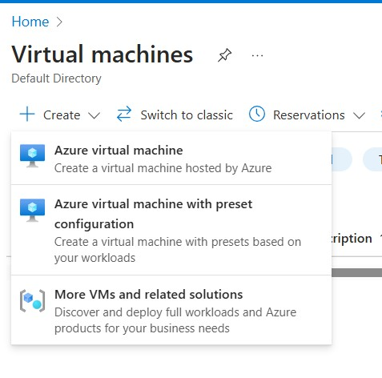
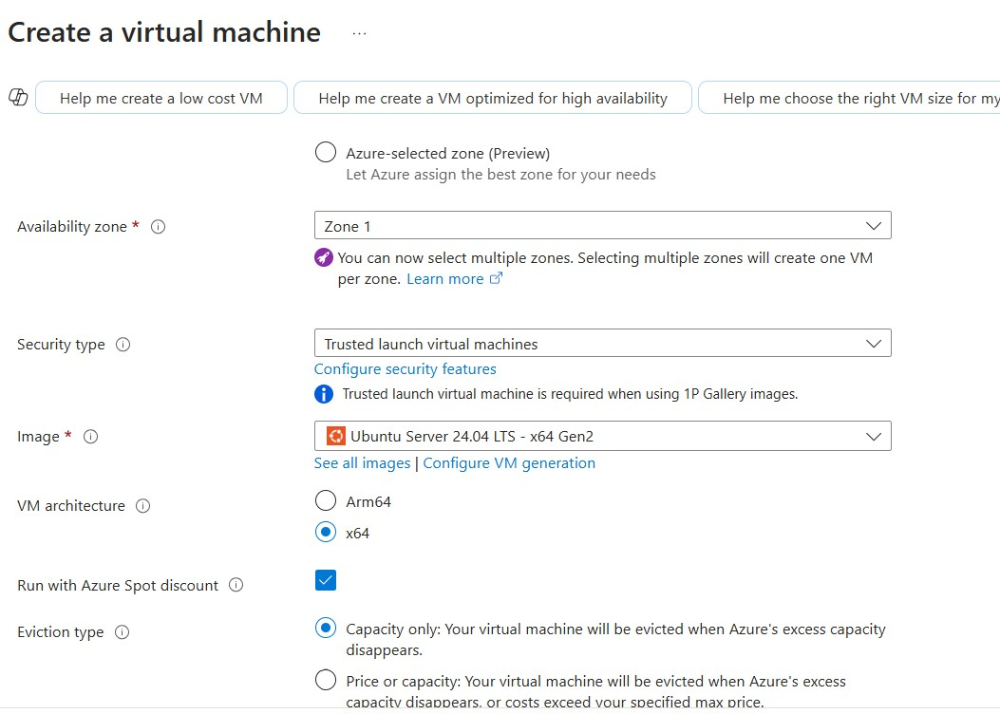
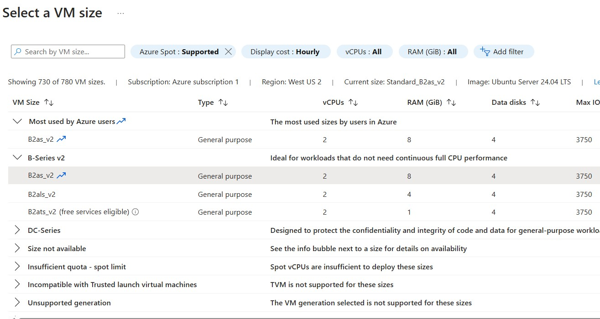
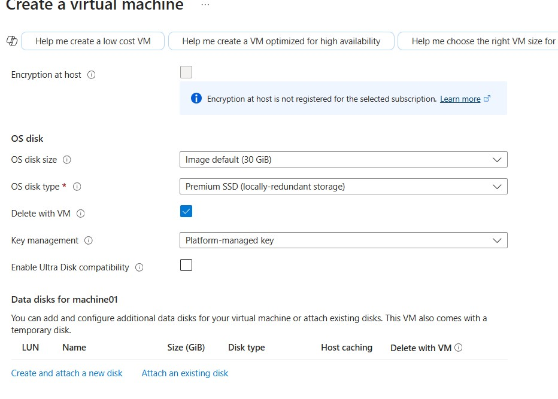
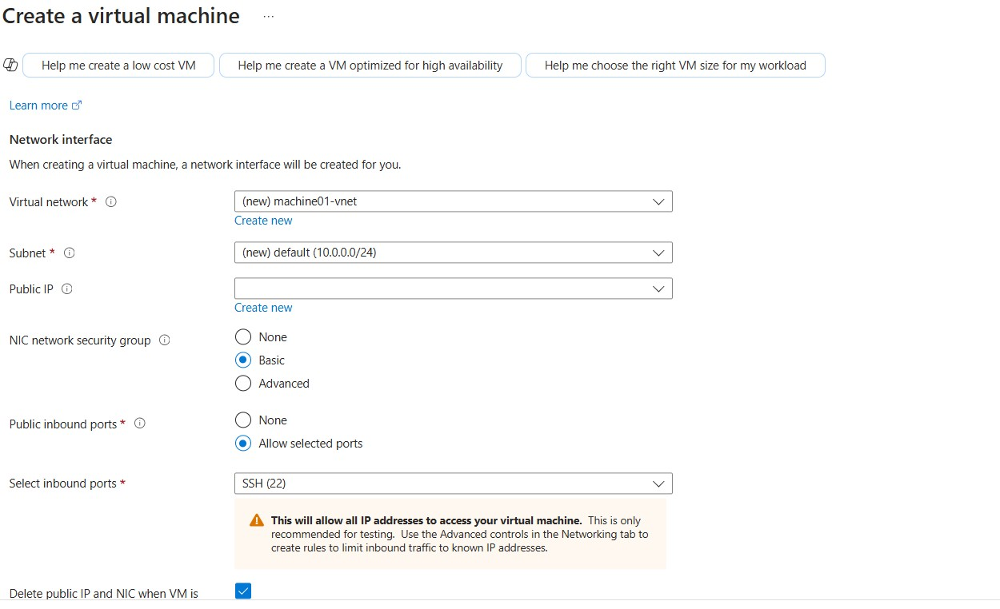
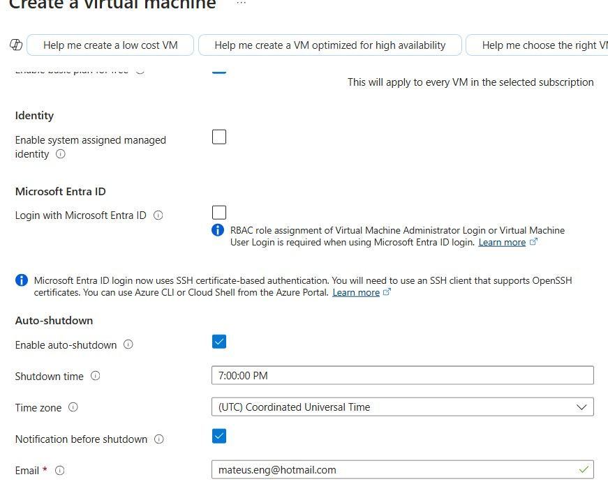
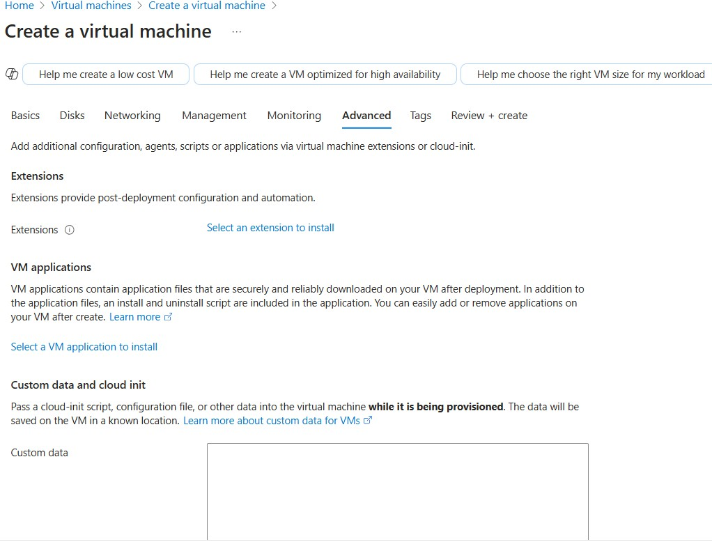
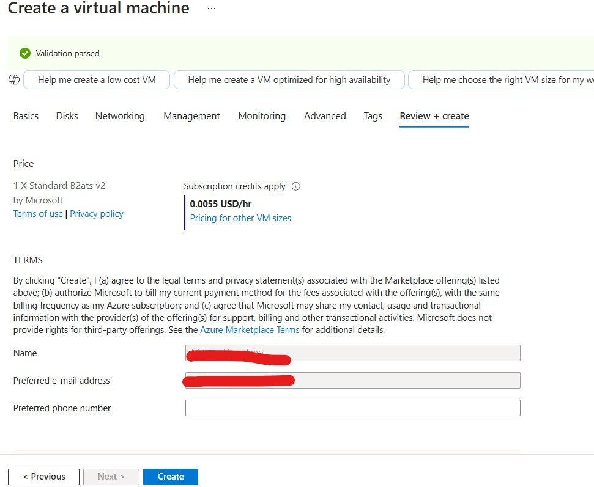
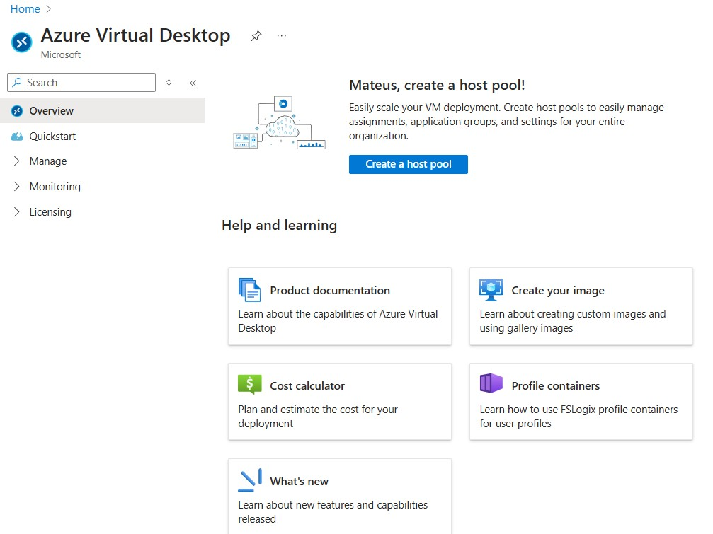
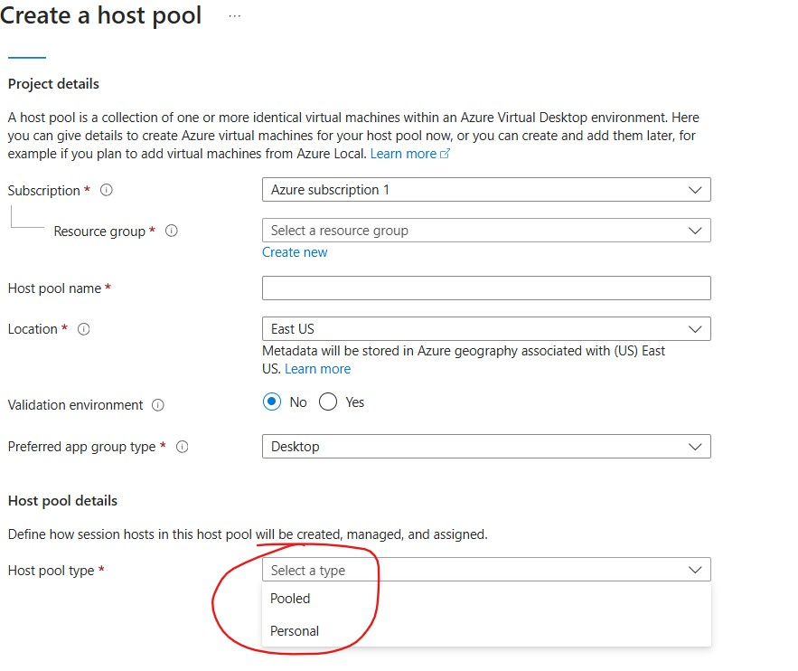

# ☁️ Máquinas Virtuais e Área de Trabalho Virtual no Azure

Este repositório documenta minha experiência prática com a criação e configuração de **Máquinas Virtuais (VMs)** e **Áreas de Trabalho Virtuais (AVD)** utilizando o portal da Microsoft Azure. 
---

## 🧰 Sobre o Projeto

Neste módulo introdutório do curso, aprendi a:

- Criar e configurar uma Máquina Virtual no Azure.
- Utilizar o recurso **Azure Spot Discount**, ativar o **Auto-shutdown** e o recurso **Delete with VM** para reduzir custos.
- Configurar **extensões** e regras de **segurança de portas**.
- Criar uma **Área de Trabalho Virtual (AVD)**, útil para trabalho remoto.

Essas práticas são fundamentais para quem deseja entender os primeiros passos da infraestrutura em nuvem e como ela pode ser usada com eficiência.

---

## ⚙️ Etapas do Processo

### 🔹 1. Criação de uma Máquina Virtual

- Acesse o portal do Azure.
- Vá até a aba **Virtual Machines** e clique em **Create → Azure Virtual Machine**.

  

---

### 🔹 2. Redução de Custos com Azure Spot

- Ative a opção **Run with Azure Spot Discount** para economizar significativamente nos custos da VM.

  

---

### 🔹 3. Escolha do Tamanho da VM

- Escolha o tamanho ideal da VM de acordo com a necessidade do projeto. Tamanhos menores custam menos.

  

---

### 🔹 4. Prevenção de Custos Indevidos

- Ative a opção **Delete with VM** para garantir que os discos e recursos associados à VM sejam excluídos automaticamente.

  

---

### 🔹 5. Configuração de Portas

- Escolha portas específicas para liberar acesso remoto com segurança.

  

---

### 🔹 6. Habilitar Desligamento Automático

- Ative a opção **Enable Auto-shutdown** para evitar cobranças extras caso esqueça a VM ligada.

  

---

### 🔹 7. Instalação de Extensões

- Adicione **extensões necessárias**, como agentes de monitoramento, antivírus ou scripts personalizados.

  

---

### 🔹 8. Revisar e Criar

- Revise todas as configurações e clique em **Review + Create** para finalizar o provisionamento da máquina.

  

---

## 🖥️ Área de Trabalho Virtual (Azure Virtual Desktop)

Além da VM tradicional, também explorei a criação de uma **Área de Trabalho Virtual no Azure**, ideal para funcionários remotos que não precisam de hardware potente localmente.

- Acesse o serviço **Azure Virtual Desktop**.
- Crie um **ambiente de trabalho pessoal ou compartilhado**, dependendo da necessidade da equipe.

  

Funcionários podem acessar o ambiente remotamente com segurança e performance, usando qualquer dispositivo com acesso à internet.

  

---

## 🛠️ Tecnologias Utilizadas

- **Microsoft Azure**: Plataforma de nuvem utilizada para provisionamento das máquinas virtuais.
- **Azure Spot Instances**: Redução de custos com instâncias sob demanda.
- **Azure Virtual Desktop**: Ambiente remoto gerenciado para colaboradores.
- **Extensões Azure**: Scripts e serviços instalados automaticamente na VM.

---

## 🎯 Conclusão

A criação e dimensionamento de Máquinas Virtuais no Azure é um passo fundamental para trabalhar com infraestrutura na nuvem. Aprender a usar **recursos econômicos e de segurança** como **Spot Discounts**, **Auto-shutdown** e **Delete with VM** é essencial para evitar custos desnecessários.

A possibilidade de criar uma **Área de Trabalho Virtual** mostra como o Azure é uma ótima solução para empresas que adotam o **modelo de trabalho remoto**.

---
